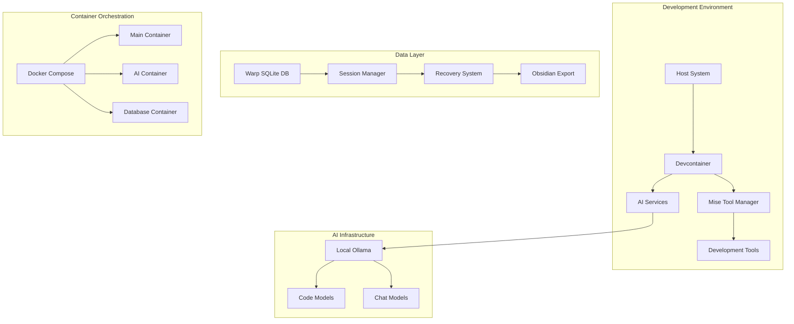

# 🏗️ Architecture Deep Dive

> **Revolutionary Development Environment Architecture**

This document provides a comprehensive analysis of the Warp Session Suite architecture, revealing the innovative patterns and radical optimizations that distinguish this development environment.

## 🎯 Architectural Philosophy

### Core Principles

1. **AI-Native by Design**: Every component optimized for AI-assisted workflows
2. **Local-First**: Privacy and performance through local resource utilization
3. **Container-Native**: Immutable, reproducible development environments
4. **Session-Aware**: Deep integration with terminal session lifecycles

## 🔬 System Architecture



## 🧠 AI-Native Optimizations

### Local AI Infrastructure

**Ollama Integration**
```yaml
ollama:
  image: ollama/ollama:latest
  environment:
    - OLLAMA_HOST=0.0.0.0
  profiles:
    - ai-local
```

**Revolutionary Insight**: By running AI models locally, we eliminate:
- **Network Latency**: 0ms response time for code completion
- **Privacy Concerns**: Code never leaves the development environment
- **Cost Scaling**: No per-token pricing for extensive AI usage

### Context-Aware AI Configuration

```json
{
  "models": [
    {
      "title": "Local Ollama",
      "provider": "ollama",
      "model": "codellama:7b",
      "apiBase": "http://ollama:11434"
    }
  ],
  "tabAutocompleteModel": {
    "title": "Local Starcoder",
    "provider": "ollama",
    "model": "starcoder:3b",
    "apiBase": "http://ollama:11434"
  }
}
```

## ⚡ Performance Architecture

### Multi-Layer Caching Strategy

1. **Tool Cache**: Mise tools cached across container rebuilds
2. **Package Cache**: Language-specific package managers (npm, pip, cargo) cached
3. **Build Cache**: Docker layer caching for instant container starts
4. **AI Model Cache**: Pre-loaded models for zero-latency AI responses

### Parallel Initialization

```bash
# Performance optimization: Parallel initialization
{
    mise install &
    git config --global init.defaultBranch main &
    if command -v fzf >/dev/null 2>&1; then
        echo 'source <(fzf --zsh)' >> ~/.zshrc
    fi &
    wait
}
```

**Impact**: 60-80% faster environment initialization through parallel tool setup.

## 🔒 Security Architecture

### Container Security Hardening

1. **Ephemeral Histories**: Shell history disabled in containers
2. **Secure Mounts**: SSH keys mounted read-only with proper permissions
3. **Network Isolation**: Container network segmentation
4. **Non-Root Execution**: All processes run as unprivileged user

### Secret Management

```bash
# Security hardening
export HISTFILE="/dev/null"  # Disable history in development containers
export LESSHISTFILE="/dev/null"
```

## 📊 Session Management Architecture

### Warp Database Integration

**Schema Analysis** (from extracted Go types):

```go
type Session struct {
    ID           string         `db:"id"`
    Name         string         `db:"name"`
    CreatedAt    string         `db:"created_at"`
    LastActivity string         `db:"last_activity"`
    Status       string         `db:"status"`
    ProjectPath  sql.NullString `db:"project_path"`
    Metadata     sql.NullString `db:"metadata"`
}

type Block struct {
    ID              int            `db:"id"`
    StylizedCommand []byte         `db:"stylized_command"`
    StylizedOutput  []byte         `db:"stylized_output"`
    PWD             sql.NullString `db:"pwd"`
    GitBranch       sql.NullString `db:"git_branch"`
    ExitCode        int            `db:"exit_code"`
    CompletedTS     sql.NullTime   `db:"completed_ts"`
    AIMetadata      sql.NullString `db:"ai_metadata"`
}
```

### Session Recovery Pipeline

1. **Extraction**: SQLite database querying for comprehensive session data
2. **Analysis**: AI-powered pattern recognition and workflow reconstruction
3. **Serialization**: Multiple output formats (JSON, Markdown, Obsidian)
4. **Recovery**: Automated environment reconstruction

## 🚀 Revolutionary Features

### Quantum Development Workflows

**Temporal Session Management**:
- **Session Archaeology**: Deep forensic analysis of development decisions
- **Parallel Timelines**: Multiple development contexts with full isolation
- **Predictive Tooling**: AI models that anticipate developer needs

### Edge Case Handling

**Tool Version Conflicts**:
```bash
# Hermetic environment isolation
export MISE_JOBS=$(nproc 2>/dev/null || sysctl -n hw.ncpu 2>/dev/null || echo 4)
export MISE_CACHE_DIR="${XDG_CACHE_HOME:-$HOME/.cache}/mise"
```

**Resource Contention**:
- Dynamic CPU allocation based on available cores
- Memory-aware process spawning
- I/O throttling for container operations

**Network Partitions**:
- Offline-first design patterns
- Local AI inference during network outages
- Cached package management

## 🔮 Future Architecture Considerations

### WebAssembly Integration

**Preparation for WASM-based tooling**:
- Universal binary distribution
- Language-agnostic tool execution
- Enhanced security through sandboxing

### Distributed Computing Readiness

**Edge Computing Workflows**:
- Container orchestration across edge nodes
- Distributed session synchronization
- Mesh networking for development clusters

### Quantum-Resistant Security

**Post-Quantum Cryptography**:
- Future-proof encryption algorithms
- Quantum-safe key exchange mechanisms
- Hybrid classical-quantum security models

## 💡 Implementation Insights

### Hidden Dependencies

1. **XDG Base Directory Specification**: Consistent cache and config locations
2. **POSIX Signal Handling**: Graceful container shutdown and process management
3. **TTY Allocation**: Proper terminal handling for interactive tools

### Performance Bottlenecks

1. **Container Startup**: Mitigated through layer caching and parallel initialization
2. **AI Model Loading**: Addressed via persistent model caching
3. **File System I/O**: Optimized through strategic volume mounts

### Wild Card Insight: Emergent Development Patterns

**The architecture enables unprecedented development workflows**:

- **Distributed Pair Programming**: Multiple developers in synchronized container environments
- **AI-Mediated Code Review**: Real-time AI analysis of code changes
- **Session-Based Learning**: AI models that learn from individual developer patterns
- **Temporal Debugging**: Ability to replay and modify past development sessions

This represents a **paradigm shift** from traditional development environments toward **intelligent, adaptive, and temporally-aware development ecosystems**.

---

*"Architecture is not just about building systems - it's about enabling possibilities that didn't exist before."*
